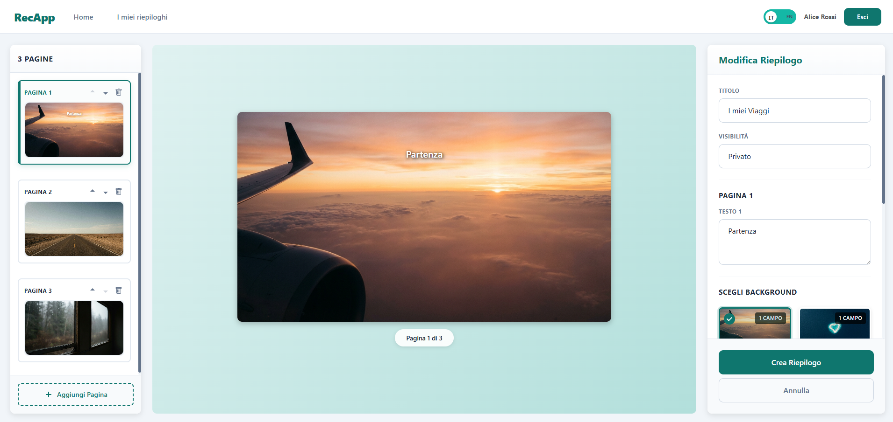

## React Client Application Routes

| Route         | Component       | Description                                                                                              |
| ------------- | --------------- | -------------------------------------------------------------------------------------------------------- |
| `/`           | HomePage        | Gallery of public recaps available for viewing                                                           |
| `/login`      | LoginPage       | Authentication page with username/password form                                                          |
| `/recaps/:id` | RecapViewPage   | Recap view (private ones require authentication) with page navigation and delete button                  |
| `/profile`    | ProfilePage     | User's personal list of owned recaps and create new button (protected)                                   |
| `/create`     | CreateRecapPage | Tab interface to choose template or derive from public recap (protected)                                 |
| `/editor/new` | RecapEditorPage | Multi-page editor to create new recap from template or clone (protected)                                 |
| `/editor/:id` | RecapEditorPage | Editor to modify existing recap with background selection, text editing, and page management (protected) |

## API Server

### Authentication (`/api/sessions`)

| Method | Endpoint                | Description                                      |
| ------ | ----------------------- | ------------------------------------------------ |
| POST   | `/api/sessions`         | Performs login and creates a user session        |
| DELETE | `/api/sessions/current` | Performs logout and destroys the current session |
| GET    | `/api/sessions/current` | Returns the authenticated user's information     |

**POST `/api/sessions`**

- **Request Body**: `{ username: string, password: string }`
- **Response (200)**: `{ id: number, username: string, name: string }`
- **Response (401)**: `{ error: "Invalid credentials" }`

**DELETE `/api/sessions/current`**

- **Response (200)**: `{ message: "Logged out successfully" }`

**GET `/api/sessions/current`**

- **Response (200)**: `{ id: number, username: string, name: string }`
- **Response (401)**: `{ error: "Not authenticated" }`

### Themes (`/api/themes`)

| Method | Endpoint                         | Description                                         |
| ------ | -------------------------------- | --------------------------------------------------- |
| GET    | `/api/themes`                    | Returns all available themes (Travel, Music, Books) |
| GET    | `/api/themes/:id`                | Returns a specific theme by ID                      |
| GET    | `/api/themes/:themeId/templates` | Returns all templates associated with a theme       |

**GET `/api/themes`**

- **Response (200)**: Array of `{ id: number, name: string, description: string, created_at: string }`

**GET `/api/themes/:id`**

- **URL Parameters**: `id` (theme ID)
- **Response (200)**: `{ id: number, name: string, description: string, created_at: string }`
- **Response (404)**: `{ error: "Theme not found" }`

**GET `/api/themes/:themeId/templates`**

- **URL Parameters**: `themeId` (theme ID)
- **Response (200)**: Array of templates with associated theme information

### Templates (`/api/templates`)

| Method | Endpoint             | Description                                           |
| ------ | -------------------- | ----------------------------------------------------- |
| GET    | `/api/templates/:id` | Returns a complete template with all associated pages |

**GET `/api/templates/:id`**

- **URL Parameters**: `id` (template ID)
- **Response (200)**: Template object with pages array, including backgrounds and pre-filled text fields
- **Response (404)**: `{ error: "Template not found" }`

### Background Images (`/api/images`)

| Method | Endpoint                  | Description                                                                 |
| ------ | ------------------------- | --------------------------------------------------------------------------- |
| GET    | `/api/images/:themeId`    | Returns all available background images for a specific theme                |
| GET    | `/api/images/details/:id` | Returns details of a specific image (URL, number of text fields, positions) |

**GET `/api/images/:themeId`**

- **URL Parameters**: `themeId` (theme ID)
- **Response (200)**: Array of `{ id, theme_id, url, text_fields_count, text_positions (parsed JSON) }`

**GET `/api/images/details/:id`**

- **URL Parameters**: `id` (image ID)
- **Response (200)**: `{ id, theme_id, url, text_fields_count, text_positions }`
- **Response (404)**: `{ error: "Image not found" }`

### Recaps (`/api/recaps`)

| Method | Endpoint             | Description                                                                                 |
| ------ | -------------------- | ------------------------------------------------------------------------------------------- |
| GET    | `/api/recaps/public` | Returns all public recaps with complete page details                                        |
| GET    | `/api/recaps/my`     | Returns all recaps of the authenticated user (public and private) - requires authentication |
| GET    | `/api/recaps/:id`    | Returns a specific recap (requires auth if private)                                         |
| POST   | `/api/recaps`        | Creates a new recap with associated pages - requires authentication                         |
| PUT    | `/api/recaps/:id`    | Updates an existing recap (only if owner) - requires authentication (TODO)                  |
| DELETE | `/api/recaps/:id`    | Deletes a recap (only if owner) - requires authentication                                   |

**GET `/api/recaps/public`**

- **Response (200)**: Array of public recaps with all pages, author, and derivation details

**GET `/api/recaps/my`**

- **Authentication**: Required
- **Response (200)**: Array of user's recaps (public and private)

**GET `/api/recaps/:id`**

- **URL Parameters**: `id` (recap ID)
- **Authentication**: Required only for private recaps
- **Response (200)**: Complete recap with pages array
- **Response (404)**: `{ error: "Recap not found" }` (if private without authentication or non-existent)

**POST `/api/recaps`**

- **Authentication**: Required
- **Request Body**: `{ title: string, theme_id: number, visibility: "public"|"private", derived_from_recap_id?: number, pages: [{ page_number, background_image_id, text_field_1?, text_field_2?, text_field_3? }] }`
- **Response (201)**: Created recap with all pages
- **Response (403)**: `{ error: "Cannot derive from a private recap" }`
- **Response (404)**: `{ error: "Original recap not found" }`

**PUT `/api/recaps/:id`**

- **Authentication**: Required (must be owner)
- **URL Parameters**: `id` (recap ID)
- **Request Body**: Same format as POST
- **Response (200)**: Updated recap
- **Response (403)**: `{ error: "Forbidden: not the owner" }`
- **Response (404)**: `{ error: "Recap not found" }`

**DELETE `/api/recaps/:id`**

- **Authentication**: Required (must be owner)
- **URL Parameters**: `id` (recap ID)
- **Response (200)**: `{ message: "Recap deleted successfully" }`
- **Response (403)**: `{ error: "Forbidden: not the owner" }`
- **Response (404)**: `{ error: "Recap not found" }`

## Database Tables

### Table `users`

Stores user account information, including unique usernames, hashed passwords with salt, and full name.

### Table `themes`

Contains available themes for recaps (Travel, Music, Books). Each theme groups images, templates, and related recaps.

### Table `background_images`

Stores available background images, associated with a specific theme. Each image supports 1-3 text fields with positions defined in JSON format.

### Table `templates`

Contains predefined templates for creating recaps. Each template is associated with a theme and includes 3 pre-configured pages with sample texts.

### Table `template_pages`

Stores template pages with sequential number, background image, and pre-filled texts. UNIQUE constraint on (template_id, page_number).

### Table `recaps`

Contains user-created recaps with title, theme, visibility (public/private), and derivation metadata (author and original title if derived).

### Table `recap_pages`

Stores user recap pages with background image and up to 3 customizable text fields. UNIQUE constraint on (recap_id, page_number).

## Main React Components

### Pages (`src/pages/`)

- **HomePage**: Displays gallery of all public recaps using RecapList.
- **LoginPage**: Authentication form with validation, error display. Password visibility toggle and redirect to Homepage.
- **ProfilePage**: User space with list of personal recaps (public/private), navigation button to creation page.
- **RecapViewPage**: Complete recap view with page navigation, text overlays on background, delete buttons (owner only).
- **CreateRecapPage**: Tab interface (Templates, Derive from Public) to choose creation mode with card preview.
- **RecapEditorPage**: Multi-page editor with BackgroundSelector, dynamic text inputs, thumbnail navigation, save/cancel modifications.

### Components (`src/components/`)

- **Navbar**: Navigation bar with logo, Home/Profile links, login/logout button, and displayed username if authenticated.
- **ProtectedRoute**: Higher-Order Component that redirects unauthenticated users to /login, protecting reserved routes.
- **RecapCard**: Recap card with first page thumbnail, title, theme, visibility badge, and derivation information (if present).
- **RecapGalleryCard**: Template/public recap card in CreateRecapPage with preview image, title, and selection button.
- **RecapList**: Responsive grid of RecapCards with loading, error states, and "no recaps found" message.
- **PagePreview**: Large preview of current page in editor with background image and text overlays at defined positions.
- **PageThumbnail**: Clickable thumbnail for page navigation in editor, with current page highlighting and sequential number.
- **BackgroundSelector**: Grid of selectable background images filtered by theme, with current selection indicator and vertical scroll.
- **CreateRecapButton**: Styled button for opening creation page, used in ProfilePage with custom icon and text.

## Main Features

### Derivation System

- Users can clone/derive only from public recaps
- Derived recaps store original metadata (ID, author, title)
- Prevents derivation from private recaps (403 error)

### Template System

- 6 predefined templates (2 per theme: Travel, Music, Books)
- Each template includes 3 pages with backgrounds and sample texts
- Usable as starting points for new recaps

### Background Images

- 36 total images (12 per theme)
- Each image supports 1, 2, or 3 text fields (4 of each)
- Text positions stored in JSON with relative coordinates `{ x, y, w, h }` (values 0-1 as percentages)

### Visibility Control

- Public recaps: visible to all users on the homepage
- Private recaps: accessible only to owner, even with direct link

### Multi-Page Editor

- Dynamic page addition/removal
- Custom background selection for each page
- Adaptive text fields based on number supported by background
- Live preview with thumbnail navigation

## Tech Stack

- **Frontend**: React 19, React Router 7, Bootstrap 5, Vite
- **Backend**: Node.js, Express.js, Passport.js (local authentication with sessions)
- **Database**: SQLite with foreign keys and indexes for query optimization
- **Validation**: Express middleware with express-validator

## Screenshots

_Recap creation phase_

_Slideshow view of an existing recap_

## User Credentials

Test users are pre-configured in the database. Credentials are displayed on the login page:

| Username  | Password       | Full Name       |
| --------- | -------------- | --------------- |
| `alice`   | `Alice2025!`   | Alice Rossi     |
| `bob`     | `Bob@2025`     | Bob Verdi       |
| `charlie` | `Charlie#2025` | Charlie Bianchi |
